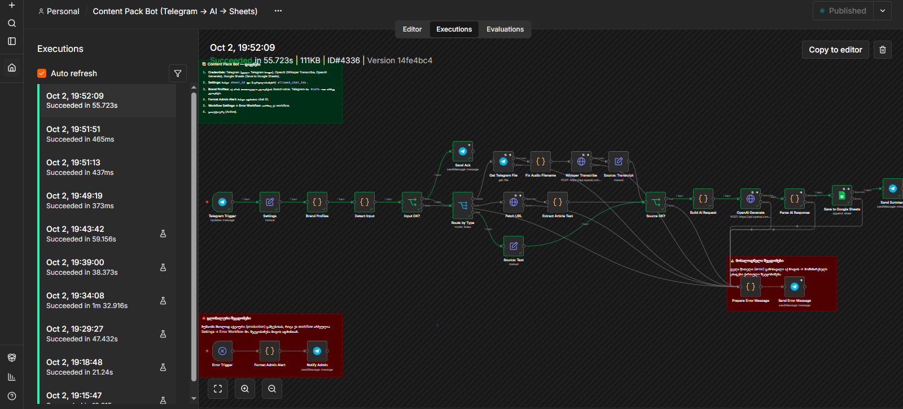
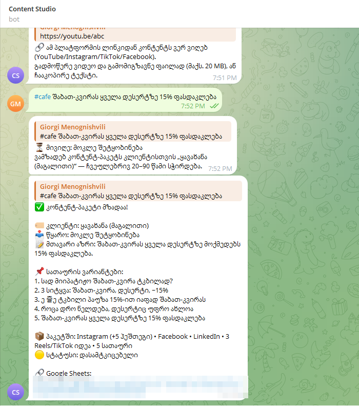
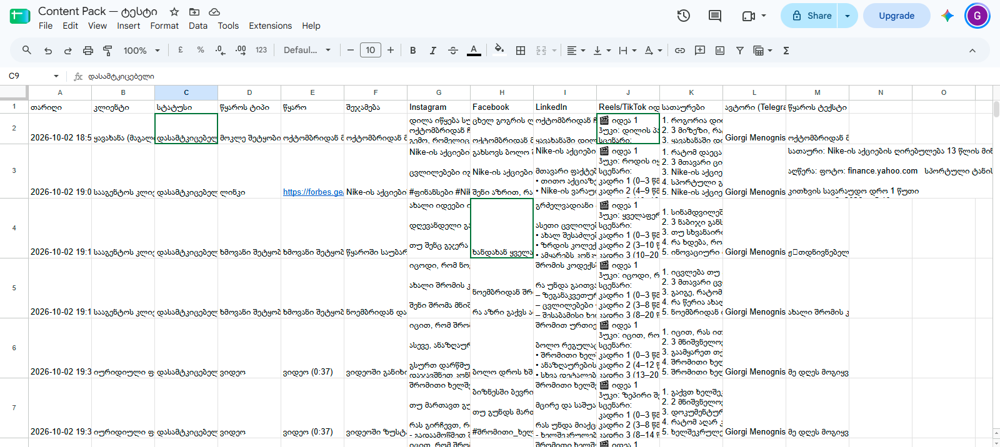
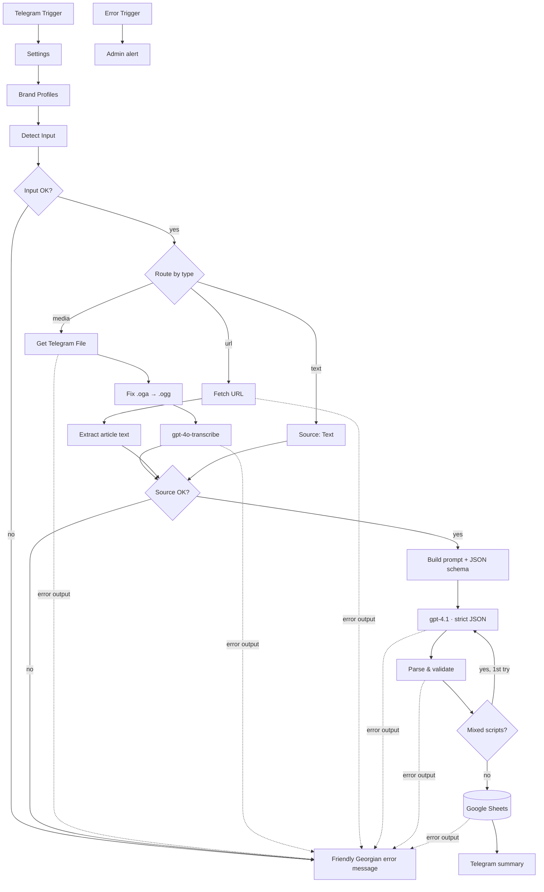

# Content Pack Bot

**One source in, a full Georgian social-media content pack out.** A marketing team sends a video, a voice note, an article link or a short brief to a Telegram bot. About a minute later the team has drafts for Instagram, Facebook and LinkedIn, three Reels/TikTok scripts and five headlines. Each pack is written in the client's brand voice and logged to Google Sheets for approval.

Built with **n8n** · **OpenAI** (gpt-4o-transcribe, gpt-4.1) · **Telegram Bot API** · **Google Sheets**

> 🇬🇪 Full setup guide in Georgian: [docs/setup-ka.md](docs/setup-ka.md)

---

## Demo

<!-- Replace with your recording, e.g. a Loom link or screenshots/demo.gif -->
📹 **Demo video:** _coming soon_

**The workflow in n8n:** a successful run, every step green.



<table>
<tr>
<th width="38%">Telegram: request → content pack summary</th>
<th>Google Sheets: one row per pack, awaiting approval</th>
</tr>
<tr>
<td valign="top"></td>
<td valign="top"></td>
</tr>
</table>

---

## What it does

| Input (Telegram) | Output |
|---|---|
| 🎥 Video / video note | **Instagram** post + 5 hashtags |
| 🎙 Voice note / audio file | **Facebook** post |
| 🔗 Article URL (+ optional instruction) | **LinkedIn** post (professional tone) |
| 📝 Article text or a short brand message | **3 Reels/TikTok ideas** (hook + shot-by-shot script) |
| `#client` tag picks the brand profile | **5 headline** variants · one-line summary |

Every pack is appended to Google Sheets with status **დასამტკიცებელი** (*awaiting approval*). The bot then replies in Telegram with a summary and the sheet link.

## Architecture



**30 nodes.** Every external call has retries and a dedicated error output. A separate Error Trigger catches anything unexpected and alerts the admin.

## Results from real end-to-end tests

| Scenario | Result |
|---|---|
| Short brand message → full pack | ✅ ~15–60 s end-to-end depending on model |
| Article URL (forbes.ge) with "focus on numbers" | ✅ Clean extraction; every figure ($33.80, 3.8%, $11.2B) carried over exactly |
| Georgian voice note | ✅ Near-verbatim transcript after switching from `whisper-1` (gibberish) to `gpt-4o-transcribe` |
| Phone video + `#law` profile | ✅ Formal tone, no emoji, legal disclaimer, brand CTA |
| Sticker / YouTube link / unreachable sheet | ✅ Clear Georgian error replies; content still delivered when Sheets fails |
| Model choice, measured over 17 generations | gpt-4.1: **0 of 9** runs with foreign-script glitches, avg 14 s · gpt-5: **6 of 8** runs (Russian, Bengali, Tamil, Malayalam, Korean, Japanese letters inside Georgian text), avg 57 s |
| Time & cost per pack (gpt-4.1) | ~15–25 s · ~$0.02 *(estimate from token usage)* |

The interesting part is what broke along the way and how it was fixed. See **[docs/lessons-learned.md](docs/lessons-learned.md)**: unsupported language codes, non-deterministic transcription, hallucination guards, a measured model comparison and several n8n gotchas.

## Key design decisions

- **Strict structured output.** The LLM must answer against a JSON schema (`strict: true`) that includes a `source_quality` flag. A validating parser then enforces counts, normalises hashtags, repairs or removes foreign-script glitches and refuses to build content from unintelligible sources.
- **Self-healing generation.** If the model mixes another script into Georgian (e.g. `кафეში`), the workflow automatically regenerates once, optionally with a `fallback_model`. If the second answer still contains foreign letters, Cyrillic is transliterated to Georgian, look-alike letters are replaced, and the editor gets a warning.
- **Natural Georgian by rule, not by luck.** The system prompt lists real "translated-sounding" phrases from test runs as forbidden patterns, prefers verbs over noun chains, and asks the model to proofread like a Georgian editor. Brand profiles also accept example posts.
- **Brand voice as data.** Each client is a profile (`brand_voice`, audience, `შენ/თქვენ` address form, CTA, rules, `vocabulary`). The vocabulary feeds both the transcription model and the LLM. Adding a client is a 5-minute change.
- **Fact preservation over creativity.** The prompt forbids inventing or "refining" facts and numbers, and tells the model to drop fragments it cannot reliably understand.
- **Human in the loop.** The bot produces strong first drafts; an editor approves them in Sheets. This is deliberate, based on test findings.
- **Workflow as code.** Code-node logic lives in [`src/nodes/`](src/nodes) with unit tests. [`scripts/build-workflow.js`](scripts/build-workflow.js) generates the importable workflow with deterministic node IDs, so diffs stay readable.

## Repository layout

```
├── workflow/content-pack-workflow.json   # import this into n8n
├── src/nodes/*.js                        # JavaScript of every Code node
├── scripts/build-workflow.js             # assembles the workflow JSON from src/
├── tests/code-nodes.test.js              # 19 unit tests (Node's built-in test runner)
├── docs/setup-ka.md                      # full setup & testing guide (Georgian)
├── docs/lessons-learned.md               # problems found in testing and their fixes
└── start-bot.cmd                         # Windows launcher: ngrok tunnel + n8n
```

## Quick start

1. **Import:** in n8n create a workflow, then paste the contents of [`workflow/content-pack-workflow.json`](workflow/content-pack-workflow.json) (Ctrl+V) or use *Import from File*.
2. **Credentials:** create three and attach them to the corresponding nodes.
   - **Telegram API**: bot token from [@BotFather](https://t.me/BotFather)
   - **OpenAI**: API key from platform.openai.com
   - **Google Sheets OAuth2**
3. **Settings node:** set `sheet_id`, and `allowed_chat_ids` to restrict who can use the bot.
4. **Google Sheet:** create a tab named `Content` with these headers in row 1:
   `თარიღი · კლიენტი · სტატუსი · წყაროს ტიპი · წყარო · შეჯამება · Instagram · Facebook · LinkedIn · Reels/TikTok იდეები · სათაურები · ავტორი (Telegram) · წყაროს ტექსტი`
5. **Error handling:** put your chat ID in *Format Admin Alert*, then in Workflow Settings → Error Workflow select this workflow.
6. **Publish.** Telegram requires a public HTTPS URL. For self-hosting, set `N8N_WEBHOOK_URL` (see [`start-bot.cmd`](start-bot.cmd)).

Step-by-step testing instructions are in [docs/setup-ka.md](docs/setup-ka.md).

## Development

```bash
npm test         # run unit tests for all Code nodes (no dependencies needed)
npm run build    # regenerate workflow/content-pack-workflow.json from src/nodes
```

## Limitations

- Telegram bots can download files up to **20 MB**. Larger videos should be sent as audio or compressed.
- YouTube, Instagram and TikTok links contain no article text, so the bot asks for the video file instead. JavaScript-only or paywalled pages cannot be extracted.
- Output quality depends on recording quality; distant or echoey audio can still be misheard. Per-client vocabulary mitigates this.
- Drafts need human review. Occasional awkward phrasing or a non-existent word still slips through.

## License

[MIT](LICENSE)
